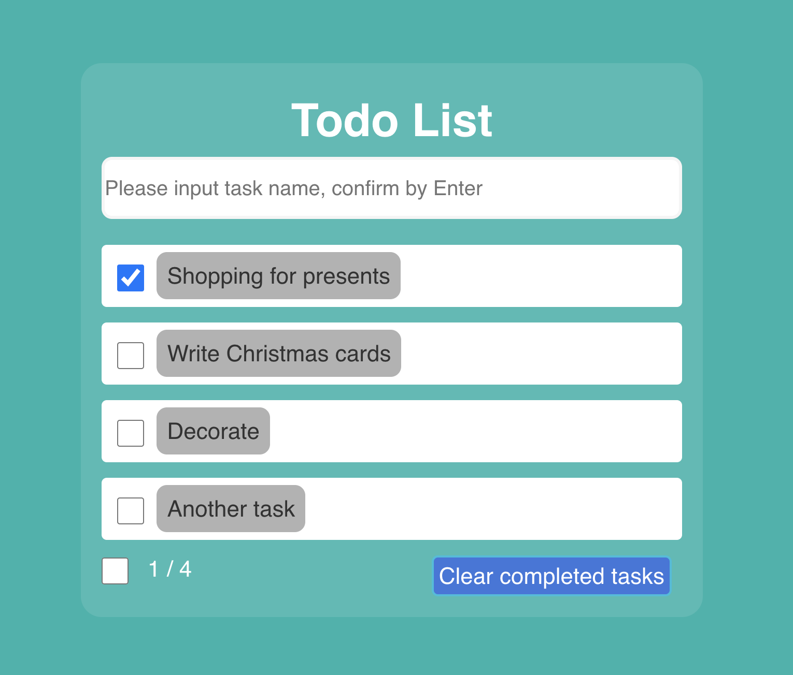

# ToDo App
A simple todo app in which you can add new tasks, mark as done, and delete.

## Preview

**Team 10:** Jingjing Yang, Josef Polasek

**Remote URL**
frontend: http://172.16.7.230:8080  or   http://22wsp3005projectteam10.student.titeweb:8080
backend: http://172.16.7.230:4040   or   http://22wsp3005projectteam10.student.titeweb:4040

## Installation
**To run these apps in docker separately:**
1. In `~/backend` run `docker build -t backend .`
2. then execute `docker run -d -p 5000:5000 backend`
3. visit http://localhost:5000 and you can see that backend is up and running.

1. In `~/frontend` run `docker build -t frontend .`
2. then execute `docker run -d -p 3000:3000 frontend`
3. visit http://localhost:3000 and you can see that frontend is up and running.

**To run both services together:**
1. From project directory run `docker-compose up -d`
2. visit http://localhost:5000 and http://localhost:3000 
3. you can see both backend and frontend are up and running.

## Completed Phases
- Phase 1
- Phase 2
- Phase 3
- Phase 4

## Expected project grade
/+ explain here

